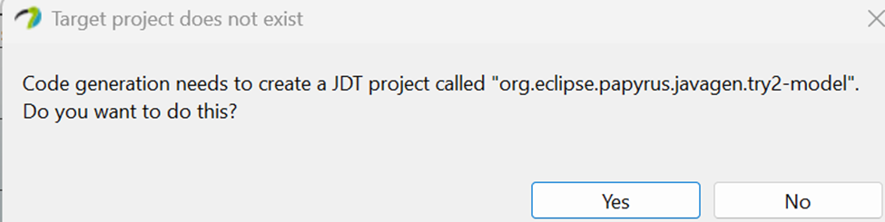

# MSSE 635 Week 6 Assignment 
### David Belett 

## Introduction

- I will be doing this a bit different because while trying Papyrus Designer, I kept getting a screen each time I went to create the code that a JDT project needed to get generated for code generation, which I clicked on yes and nothing ever happened 
    - Also tried no and got the same.
    - Per the gitlab readme, this is common for the first project, but and I am supposed to click yes and something will auto populate, but that never happened with me, I believe it might have to do with me using an ARM-based processor while the only download for Windows was an AMD one, so problems tend to occur if an ARM version is not available, seeing that the download will not have support come 2026 I am not surprised only one version is available for Windows, another reason for me to switch to Mac in the future.

-	Due to this, I was unable to get Papyrus Designer to generate code for me, so instead I am creating Java code following the instructions, instead of doing it through Papyrus Designer
    

- The actual code will be located in different parts of this repo.